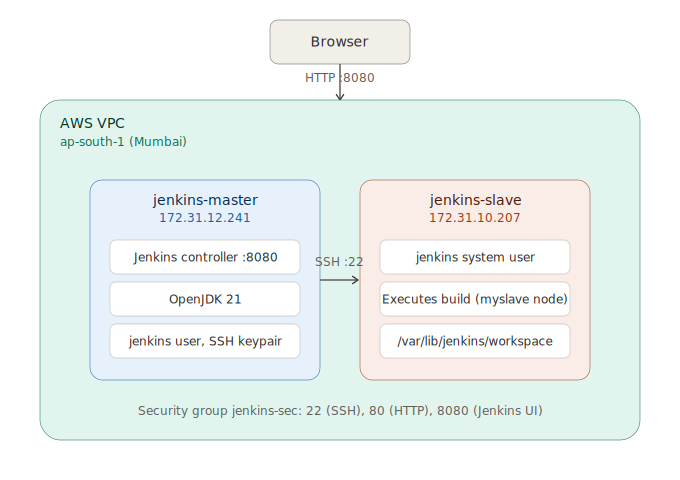
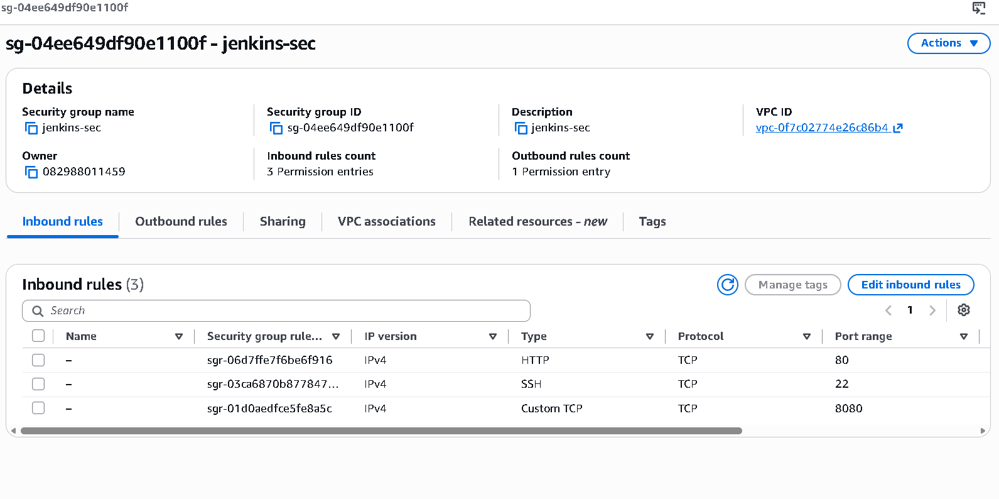
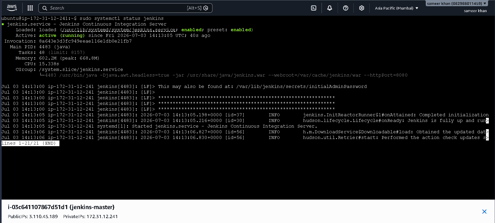
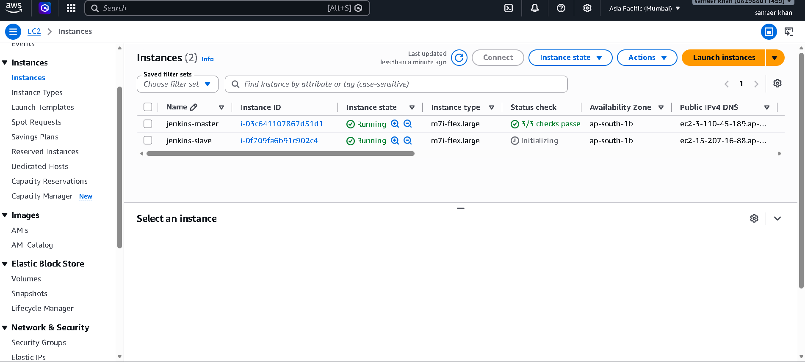
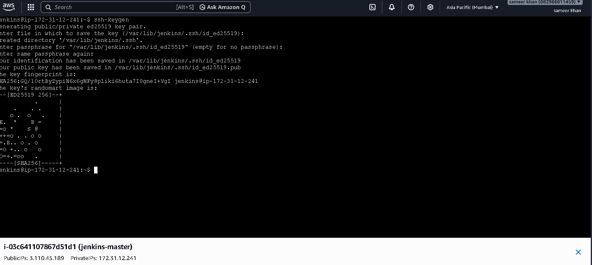
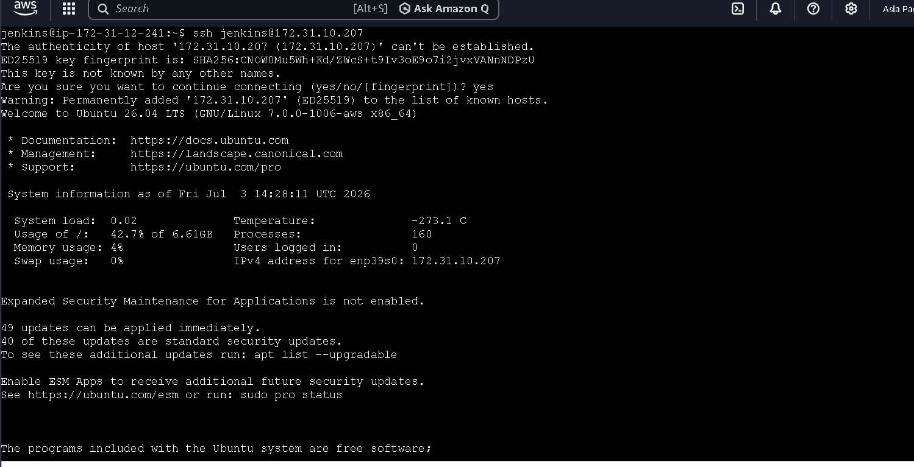
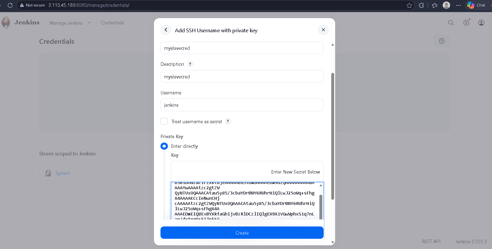
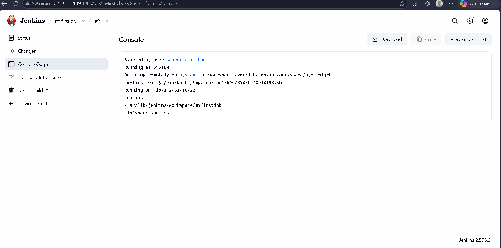

# Jenkins Master-Slave (Distributed Build) Setup on AWS EC2

A hands-on project where I set up a **Jenkins Master-Slave architecture** from scratch on AWS EC2 — provisioning two Ubuntu instances, installing Jenkins on the master, configuring a dedicated agent (slave) node over SSH, and successfully running a Freestyle job remotely on the slave.

This repo documents the full journey: infrastructure setup, security group configuration, Jenkins installation, SSH-based master-slave connection, and a working end-to-end build.

---

## 🏗️ Architecture



- **Master** hosts the Jenkins controller (web UI, job scheduling, plugin management).
- **Slave (Agent)** is a separate EC2 instance that only executes the build steps, connected to the master via **SSH**.
- Both instances run in the same VPC for low-latency private communication (`172.31.x.x` private IPs).

---

## 🔐 Security Group Configuration (`jenkins-sec`)

| Type       | Protocol | Port | Purpose                          |
|------------|----------|------|-----------------------------------|
| HTTP       | TCP      | 80   | Standard web access               |
| SSH        | TCP      | 22   | Remote login + master↔slave comm  |
| Custom TCP | TCP      | 8080 | Jenkins Web UI                    |



Both EC2 instances (`jenkins-master`, `jenkins-slave`) were launched as `m7i-flex.large` in the `ap-south-1` (Mumbai) region and share this security group.

---

## ⚙️ Setup Steps

### 1. Launch EC2 Instances
Two Ubuntu 26.04 LTS instances were launched — `jenkins-master` and `jenkins-slave` — inside the same VPC, both attached to the `jenkins-sec` security group.

### 2. Install Java on the Master
Jenkins requires Java to run, so OpenJDK 21 was installed first:
```bash
sudo apt install openjdk-21-jdk -y
```

### 3. Install Jenkins on the Master
Added the official Jenkins Debian repository and installed it:
```bash
sudo wget -O /etc/apt/keyrings/jenkins-keyring.asc \
  https://pkg.jenkins.io/debian-stable/jenkins.io-2026.key

echo "deb [signed-by=/etc/apt/keyrings/jenkins-keyring.asc]" \
  https://pkg.jenkins.io/debian-stable binary/ | sudo tee \
  /etc/apt/sources.list.d/jenkins.list > /dev/null

sudo apt update
sudo apt install jenkins -y
```

Verified the service was active:
```bash
sudo systemctl status jenkins
```
✅ `active (running)` — Jenkins fully up and running on port `8080`.





### 4. Initial Jenkins Web Setup
- Accessed Jenkins at `http://<master-public-ip>:8080`
- Retrieved the initial admin password from `/var/lib/jenkins/secrets/initialAdminPassword`
- Created the first admin user through the **Getting Started** wizard

### 5. Prepare the Slave Node
On the `jenkins-slave` instance, a dedicated **`jenkins`** system user was created (this is the user the master will SSH into and run builds as):
```bash
sudo useradd -m -d /var/lib/jenkins -s /bin/bash jenkins
sudo passwd jenkins
sudo nano /etc/sudoers
```

### 6. Generate SSH Keys on the Master
Switched to the `jenkins` user on the master and generated an SSH key pair to authenticate with the slave:
```bash
ssh-keygen
```
This created `id_ed25519` (private) and `id_ed25519.pub` (public) inside `/var/lib/jenkins/.ssh/`.



### 7. Connect Master to Slave
The public key was copied over to the slave's `authorized_keys`, and connectivity was verified with a manual SSH login:
```bash
ssh jenkins@172.31.10.207
```
First-time connection accepted the host fingerprint, confirming SSH trust was established between the two nodes.



### 8. Add SSH Credentials in Jenkins
Under **Manage Jenkins → Credentials**, added a new credential:
- **Kind:** SSH Username with private key
- **ID:** `myslavecred`
- **Username:** `jenkins`
- **Private Key:** pasted directly from the master's `id_ed25519`



### 9. Configure the Slave Node in Jenkins
Registered the slave as a new **Node** (`myslave`) under **Manage Jenkins → Nodes**, using the SSH credential above to connect. Once online, the Jenkins dashboard showed both executors:

```
Build Executor Status
 ├── Built-In Node   0/2
 └── myslave         0/1
```

### 10. Run a Test Job on the Slave
Created a Freestyle project (`myfirstjob`) and restricted it to run on the `myslave` node. The build executed successfully:

```
Building remotely on myslave in workspace /var/lib/jenkins/workspace/myfirstjob
Running on: ip-172-31-10-207
jenkins
/var/lib/jenkins/workspace/myfirstjob
Finished: SUCCESS
```



🎉 Confirmed — the job ran **on the slave**, not the master, proving the distributed build setup works end-to-end.

---

## 🧠 Key Concepts Demonstrated

- Provisioning and securing EC2 infrastructure for CI/CD
- Installing and configuring Jenkins from the official repository (not a pre-built AMI)
- Setting up **passwordless SSH authentication** between two Linux servers
- Registering and managing a **Jenkins agent/slave node**
- Understanding Jenkins' credential store for SSH-based node connections
- Verifying distributed build execution via console output

---

## 📌 Notes / Gotchas Faced

- `useradd` initially rejected `/jenkins` as an invalid username — fixed by dropping the leading slash.
- The `jenkins` system user needed a proper home directory (`/var/lib/jenkins`) to match Jenkins' default agent root, so SSH keys and workspaces resolve correctly.
- Had to explicitly accept the SSH host key fingerprint the first time connecting master → slave, otherwise the Jenkins node fails to come online.

---

## 🚀 Possible Next Steps

- Automate this entire setup using **Terraform** (EC2 provisioning) + a **shell/Ansible bootstrap script** (Jenkins + Java install) instead of manual console steps
- Add a **Jenkinsfile** (Pipeline as Code) instead of a Freestyle job
- Integrate Docker on the slave to run containerized build steps
- Add a second slave to demonstrate load distribution across multiple agents

---

## 🛠️ Tech Stack

`AWS EC2` · `Ubuntu 26.04 LTS` · `Jenkins 2.555.3` · `OpenJDK 21` · `SSH` · `Bash`

